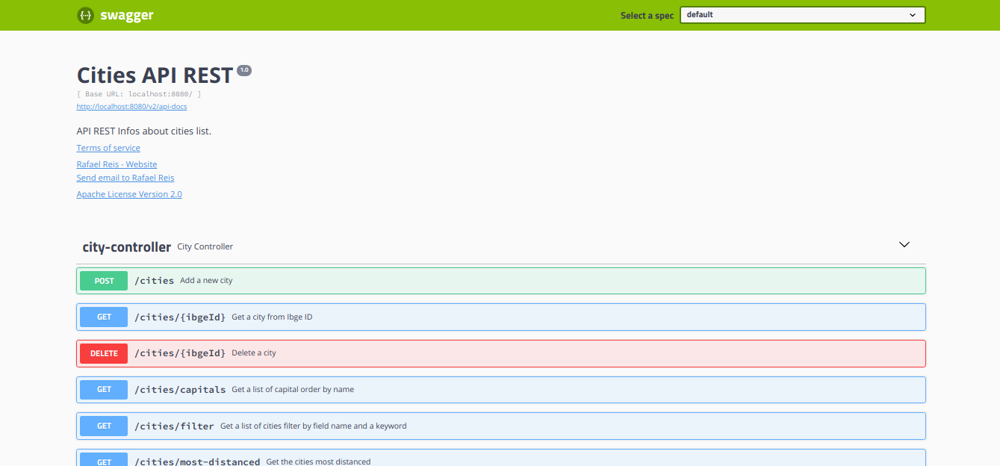

<h4 align="center">
<br>
 <b>Projeto Cidades!!!</b> 
</h4>
<p align="center">
  <a href="https://github.com/rafaelisaiasreis">
    
  </a>
  
</p>

<br>

### :rocket: Tecnologias usadas
Este maravilindo projeto foi desenvolvido com as seguintes tecnologias:
- [Spring](https://spring.io/)
- [Java](https://www.java.com/)
- [FlyWay](https://flywaydb.org/)
- [ModelMapper](http://modelmapper.org/)
- [OpenCSV](http://opencsv.sourceforge.net/)
 - [Swagger](https://swagger.io/)


### :muscle: Projeto

O projeto consiste em desenvolver uma API REST para digerir um arquivo CSV, contendo uma lista das cidades brasileiras, bem como suas informações, como :

> nome, micro região , meso região, nome sem acentos,ID do IBGE ...

Persistindo esses dados em uma tabela no banco de dados e disponibilizando para o usuário , diversos endpoints para consultas personalizadas.

<br>

### :floppy_disk: Instalação <br>

### Instalando Docker
Execute os passos a seguir caso não possua o docker e o docker-compose instalados.

Digite no seu terminal:
```
sudo apt update
sudo apt install docker.io -y
docker --version
```
Instalação do curl:
```
sudo apt update
sudo apt install curl -y
curl --version
```
 
### Documentação Docker Compose
https://docs.docker.com/compose/install
### Releases Docker Compose:
https://github.com/docker/compose/releases
### Instalação do Docker Compose:
```
sudo apt update
sudo curl -L "https://github.com/docker/compose/releases/download/1.26.2/docker-compose-$(uname -s)-$(uname -m)" -o /usr/local/bin/docker-compose
sudo chmod +x /usr/local/bin/docker-compose
sudo ln -s /usr/local/bin/docker-compose /usr/bin/docker-compose
```
O projeto foi feito utilizando-se o banco de dados `MySQL` , caso já o possua instalado , e não deseje utilizar o **`Docker`** para montar o ambiente,  apenas substitua as informações no application.properties.

**application.properties**
```
#Basic Spring Boot Config for MySQL  
spring.datasource.url=jdbc:mysql://localhost:3306/<DATABASE>  
spring.datasource.username=<USERNAME>  
spring.datasource.password=<PASSWORD>
```
:exclamation: Crie o database e faça os devidos apontamentos nas configurações, não é necessário criar a tabela, uma vez que o flyway se encarregará de criá-la para nós.

Caso deseje utilizar o **`Docker`**, entre na pasta do projeto via terminal, onde se encontra o arquivo `docker-compose.yml`, e execute o comando:

    sudo docker-compose up
Ao final do processo , seu ambiente com MySQL deverá estar montado . É possível que a porta apontada dentro do arquivo `docker-compose.yml` já esteja em uso no sua máquina, se for este o caso , edite o arquivo , mudando o apontamento para uma porta disponível.
```
ports:
-  "<altere-essa-porta>:3306"
```
:pencil2: **Configurações Adicionais**
O processo de digest do arquivo CSV,  pode ser configurado no `application.properties`:
```
#Digest Configuration  
projeto.cidade.csv.path=src/main/resources/digest/grupo-de-cidades.csv  
projeto.cidade.load-city-table=true
```
:file_folder: **projeto.cidade.csv.path :** local onde a aplicação irá buscar o arquivo CSV para digerir.
:lock: **projeto.cidade.load-city-table**: Habilita ou desabilita a rotina de digest do CSV e persistência no Data Base.

:minidisc: **RUN**
Após importa o projeto para sua IDE, basta ir até a classe `ProjetoCidadeApplication`e executar o método main como Java Application.

:orange_book:**SWAGGER**
Para acessar a documentação da aplicação , após a mesma estar em execução , acesse o link : [http://localhost:8080/swagger-ui.html](http://localhost:8080/swagger-ui.html)

### :recycle: Como contribuir

- Fork esse repositório;
- Crie uma branch com a sua feature: `git checkout -b my-feature`
- Commit suas mudanças: `git commit -m 'feat: My new feature'`
- Push a sua branch: `git push origin my-feature`


### :memo: Licença

Esse projeto está sob a licença MIT. Veja o arquivo [LICENSE](LICENSE.md) para mais detalhes.


Feito com ❤️**Rafael Reis**:wave:
